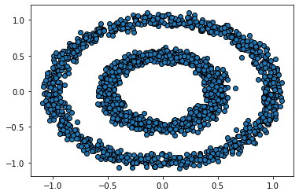
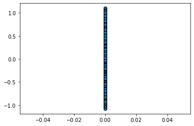

# Topology-Mapper

## Requirements
* [python 3.x](https://www.python.org/)
* [numpy](https://numpy.org/)
* [networkx](https://networkx.github.io/)
* [pyvis](https://pyvis.readthedocs.io/en/latest/)
* [scikit-learn](https://scikit-learn.org/stable/)

## What is Mapper?
Mapper is an unsupervised algorithm that is used to construct a simplicial complex (a graph) that represents the structure of data. It reveals topological features of the data so that the data can be explored better.

To construct the graph, we require:
1. A Filter function
2. A cover of the domain of the Filter function.

The filter function is used to represent the data in a lower dimension space. Dimensionality-reduction techniques like PCA or t-SNE could be used here if required for data in very high dimensions.

## An Example
Below is the data on the left, and the data as seen through the filter function, which is f(x, y) = y here, on the right.
 

A cover of the domain (say, (-1.3, 1.3)) of the filter function could be the overlapping intervals (-1.3, -0.6), (-0.8, -0.1), (-0.3, 0.4), (0.2, 0.9), (0.6999999999999997, 1.3). The 