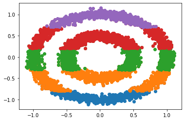

# Mapper - Topological Data Analysis

## Requirements
* [python 3.x](https://www.python.org/)
* [numpy](https://numpy.org/)
* [networkx](https://networkx.github.io/)
* [pyvis](https://pyvis.readthedocs.io/en/latest/)
* [scikit-learn](https://scikit-learn.org/stable/)

## What is Mapper?
Mapper is an unsupervised algorithm that is used to construct a simplicial complex (a graph) that represents the structure of data. It reveals topological features of the data so that the data can be explored better.

To construct the graph, we require:
1. A Filter function
2. A cover of the domain of the Filter function.

The filter function is used to represent the data in a lower dimension space. Dimensionality-reduction techniques like PCA or t-SNE could be used here if required for data in very high dimensions.

## An Example
Below is the data on the left, and the data as seen through the filter function, which is f(x, y) = y here, on the right.
 

A cover of the domain (say, (-1.3, 1.3)) of the filter function could be the overlapping intervals (-1.3, -0.6), (-0.8, -0.1), (-0.3, 0.4), (0.2, 0.9), (0.7, 1.3). The points that belong to an interval as given by the filter function are collected from the original data and a clustering algorithm is run on each set of points. The below plot shows the data being split by the cover (overlaps are not shown).

After forming clusters, each cluster is represented by a node in a graph, with edges connecting two nodes only if the clusters corresponding to the nodes have a non-empty set intersection. The final result of this operation is shown [here](https://thiswasnttaken.github.io//assets/html/mapper.html). It can be seen that there are two cycles in the graph that correspond to the two circles in the data. However, the feature that the two circles are concentric is NOT captured by Mapper.

<html>
<head>
<link rel="stylesheet" href="https://cdnjs.cloudflare.com/ajax/libs/vis/4.16.1/vis.css" type="text/css" />

<!-- <link rel="stylesheet" href="../node_modules/vis/dist/vis.min.css" type="text/css" />
-->

</head>

<body>

</body>
</html>