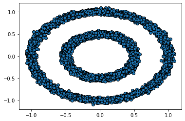

# Mapper - Topological Data Analysis

## Requirements
* [python 3.x](https://www.python.org/)
* [numpy](https://numpy.org/)
* [networkx](https://networkx.github.io/)
* [pyvis](https://pyvis.readthedocs.io/en/latest/)
* [scikit-learn](https://scikit-learn.org/stable/)

Refer to requirements.txt for a complete list of packages and libraries.

## What is Mapper?
Mapper is an unsupervised algorithm that is used to construct a simplicial complex (a graph) that represents the structure of data. It reveals topological features of the data so that the data can be explored better.

To construct the graph, we require:
1. Filter functions that map the data to a lower dimension.
2. Covers for the range of each filter functions with overlapping between each pair of consecutive intervals.

The filter function is used to represent the data in a lower dimension space. Dimensionality-reduction techniques like PCA or t-SNE could be used here if required for data in very high dimensions.

## An Example
Consider a data created using the following function on sklearn.
```python
make_circles(n_samples = 10000, noise = 0.05, random_state = 44, factor = 0.5)
```
The data is a pair of concentric circles as shown below on the left. The filter function (lens) is `f(x, y) = y`. The data as seen through the lens is shown on the right.

 

Let the cover of the range of the filter function be in the interval (-1.3, 1,3), with a uniform interval length of 0.1 and an overlap of 0.03 - {(-1.3, -1.2), (-1.23, -1.13), ... (1.22, 1.3)}