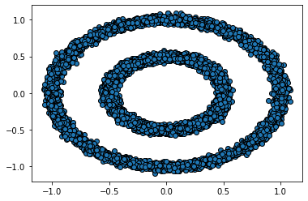
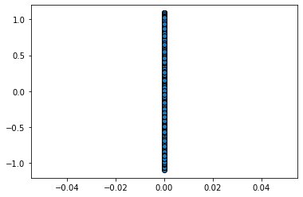
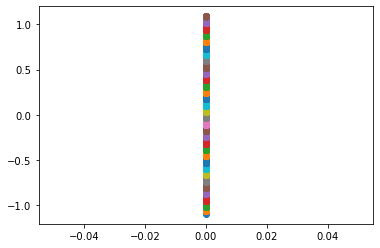
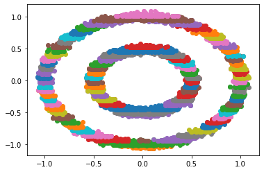
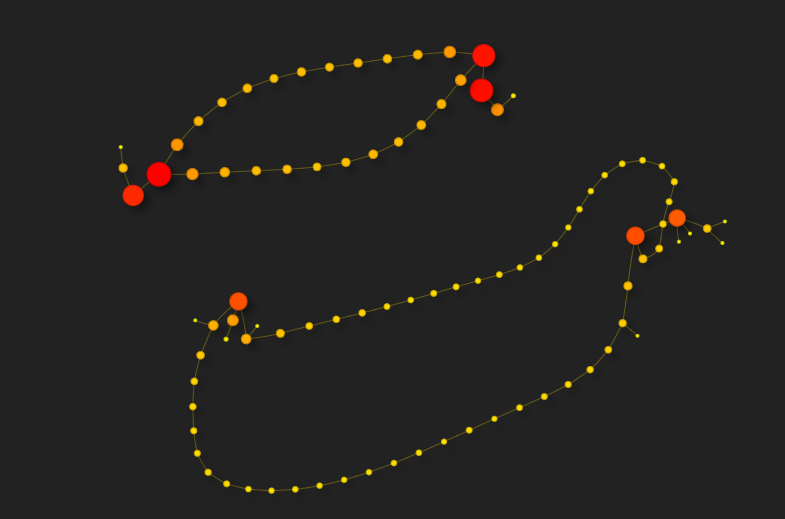

# Mapper - Topological Data Analysis

## What is Mapper?
Mapper is an unsupervised algorithm that is used to construct a simplicial complex (a graph) that represents the structure of data. It reveals topological features of the data so that the data can be explored better.

To construct the graph, we require:
1. Filter functions that map the data to a lower dimension.
2. Covers for the range of each filter functions with overlapping between each pair of consecutive intervals.

The filter function is used to represent the data in a lower dimension space. Dimensionality-reduction techniques like PCA or t-SNE could be used here if required for data in very high dimensions.

## An Example
Consider data created using the following function on sklearn.
```python
make_circles(n_samples = 10000, noise = 0.05, random_state = 44, factor = 0.5)
```
The data is a pair of concentric circles as shown below on the left. The filter function (lens) is `f(x, y) = y`. The data as seen through the lens is shown on the right.

 

Let the cover of the range of the filter function be in the interval (-1.3, 1,3), with a uniform interval length of 0.1 and an overlap of 0.03. Explicitly, the cover is **{(-1.3, -1.2), (-1.23, -1.13), ... (1.22, 1.3)}**. The data is split using the filter function `f(x, y) = y` as shown below in the figure to the left. The data points in the original data retrieved by the inverse of `f` so that they are split into groups as shown in the figure to the right.

 

Since the intervals in the cover are overlapping, consecutive intervals can contain common points. Each cluster in the data is made a node in a graph, and edges are added between two nodes only if the two nodes contain a common data point. The graph obtained on the above data after this operation is shown below.



Click [here](https://thiswasnttaken.github.io//assets/html/make_circles(n_samples%20=%2010000,%20noise%20=%200.05,%20random_state%20=%2044,%20factor%20=%200.5).html) for an interactive version.

Each cycle in the graph corresponds to a circle in the data. However, the feature that the two circles are concentric is not captured by Mapper.

3 Examples have been added in the file mapper.py, one of which uses data from the GNU Triangulated Surface library. A data extractor has been provided to create point cloud data from any .gts file.

## Instructions
This implementation of Mapper includes support for multiple filter functions and for any dimension space. However, This implementation does NOT add Simplexes of dimension 2 or above. This was done because higher dimensional Simplexes cannot be visualized in any case, and a graph (a 1-dimensional Simplex) is sufficient for a visualization.

This implementation included additional utility functions which are given below:

1. Mapper.get_cover(range, interval_len, overlap):
	constructs a cover for the given range of the filter function.

	Parameters:
    - range 	    : the ranges of the filter functions, a list of n tuples (low, high) for n dimensions
    - interval_len 	: the length of the intervals to be created for the cover, a list of n integers for n dimensions
    - overlap	    : the overlap between two consecutive intervals, a list of n integers for n dimensions

	Returns:
    - a list of n lists for n dimensions

2. get_data_from_gts(gts_file_name):
	extracts data from a GNU Triangulated Surface data file (.gts).

	Parameters:
    - gts_file_name	: the file path of the .gts data file

	Returns:
    - point cloud data in the format of numpy.array()

The file mapper.py also includes 3 examples, one of which uses a .gts file. The flow of the algorithm is generally as follows:
1. Create or extract data from a .gts file.
2. Instantiate the Mapper class by passing the data as a parameter.
3. Define (a) filter function(s) in python as required.
4. Create or use the Mapper.get_cover function to generate a cover for the range of the filter function(s).
5. Create an instance of a clustering algorithm. An unsupervised clustering algorithm like DBScan is ideal.
6. Cluster the n-dimensional space by calling get_clusters on the Mapper instance and passing the filter function, the cover, and the clustering algorithm.
7. Call create_graph on the Mapper instance to create a graph by passing in the file name to save the graph as.

Run the algorithm by the command
```
python mapper.py 
```
in the appropriate directory.

All requirements are listed in requirements.txt. These can be installed in a python virtual environment by the command
```
pip install -r requirements.txt
```
after creating a virtual environment with python 3.x.